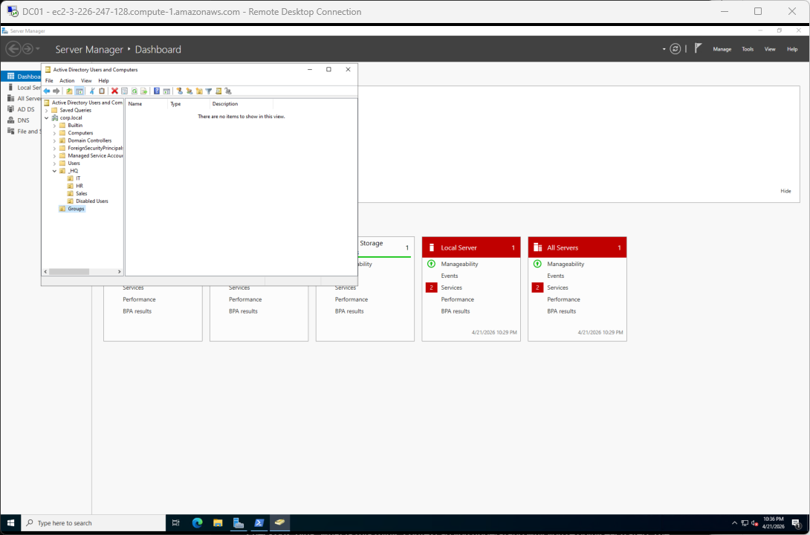

# Active Directory Help-Desk Lab (AWS)

A hands-on Tier 1 and desktop support portfolio built on a two-machine AWS Active Directory environment. I stood up a domain controller and a domain-joined client from scratch on EC2, then worked three help-desk scenarios end to end: onboarding a new hire, resetting a locked-out user's password, and troubleshooting a Group Policy Object that wasn't applying to the right people.

When a ticket comes in ("new hire needs an account", "Bob's locked out", "why don't the new desktop policies work on Cara's machine"), this project shows how I move from intake to verified fix, with screenshots at every step.

---

## What this project demonstrates

- **Active Directory fundamentals**: forest and domain build, OU hierarchy, user and group object creation, domain-joining a client
- **Core help-desk skills**: password reset, account unlock, account lockout policy, new-hire provisioning, GPO troubleshooting
- **GUI and PowerShell parity**: every workflow shown in ADUC / GPMC and in PowerShell, because Tier 1 uses both
- **Group Policy reasoning**: why a policy applies or doesn't, scope vs. link, Block Inheritance, `gpresult` interpretation
- **AWS gotcha-awareness**: security-group self-references, ENI primary-IP behavior, the RDP + NLA + forced-change limitation, per-AMI firewall profile shifts
- **Professional documentation**: each scenario is a self-contained writeup a teammate or auditor could follow

---

## The environment

**Topology**

```
         Internet
            │
            ▼
     ┌──────────────┐
     │   AWS VPC    │  10.0.0.0/16
     │              │
     │ ┌──────────┐ │
     │ │  Subnet  │ │  10.0.0.0/20  (public)
     │ │          │ │
     │ │  DC01    │ │  10.0.1.10    Windows Server 2022, AD DS, DNS
     │ │  CLIENT01│ │  10.0.1.20    Windows Server 2022 (acts as client)
     │ └──────────┘ │
     └──────────────┘
```

**Domain:** `corp.local`
**DC:** `DC01` (Windows Server 2022, t3.small, running AD DS + DNS + GPMC)
**Client:** `CLIENT01` (Windows Server 2022, t3.small, domain-joined member server)

> **AMI note:** AWS Free Tier does not offer Windows 10 / 11 desktop images, so `CLIENT01` runs Windows Server 2022 acting as a workstation. Every AD operation looks identical either way (domain join, GPO application, password reset, logon), so the learning and the screenshots translate one-to-one.

**The OU and group structure I built inside the domain:**



---

## Skills

AD DS, AD DS role promotion and forest creation, DNS server and forward-lookup zone management, OU hierarchy design, security-group creation and membership (`GS-` global security groups), AGDLP nesting for RDP access delegation, account lockout policy at the domain level, password reset and account unlock (GUI and PowerShell), GPO creation, linking, Block Inheritance troubleshooting, Windows Server 2022 administration, ADUC, GPMC, PowerShell AD module cmdlets (`New-ADUser`, `Set-ADUser`, `Get-ADUser`, `Set-ADAccountPassword`, `Unlock-ADAccount`, `Move-ADObject`, `Add-LocalGroupMember`), CSV-based bulk user provisioning with `Import-Csv` and `ForEach-Object`, domain join workflow, `gpresult /r` and `gpresult /h`, `gpupdate /force`, Windows Firewall profile awareness (Public / Private / Domain), RDP and NLA interaction with forced-password-change flag, AWS EC2 instance provisioning, AWS VPC and subnet CIDR planning (`/16`, `/20`), AWS security group rules including self-referencing rules for AD traffic, Tier 1 help-desk ticket documentation.

---

## The scenarios

Each scenario is a self-contained writeup with the user's reported symptom or request, the diagnostic path, the fix, and a verification step. Click a scenario title to read the full writeup.

| # | Scenario | What it covers |
|---|----------|----------------|
| [**S01: New hire onboarding**](scenarios/S01-new-hire-onboarding.md) | "New hire Sarah Connor is starting Monday in Sales, please set her up." | Create a user in the right OU, populate profile and manager attributes, add to department and company-wide groups, verify first-logon experience, then bulk-provision five more hires from a CSV with PowerShell. |
| [**S02: Password reset & account unlock**](scenarios/S02-password-reset-and-unlock.md) | "User jsmith is locked out and needs his password reset." | Configure domain lockout policy, reproduce a lockout from wrong-password attempts, unlock and reset through ADUC, do the same through PowerShell, then meet and work around the Windows limitation where RDP + NLA will not pass a forced-change logon. |
| [**S03: Group Policy troubleshooting**](scenarios/S03-gpo-troubleshooting.md) | "Corporate desktop wallpaper isn't showing up for user cpatel." | Create a user-scope GPO, link it to an OU, verify it applies on a fresh logon, diagnose why it didn't apply to one user using `gpresult` and `Get-ADUser`, fix the OU placement, then break it on purpose with Block Inheritance to show how linked-at-parent policies fail silently. |

---

## How I worked each scenario

Every scenario followed the same pattern:

1. **Read the ticket as the user wrote it.** Rephrase the symptom in plain language. Write down the one-sentence version I'd give a manager.
2. **Split the work between the DC and the client.** DC work (ADUC, GPMC, AD module PowerShell) stayed in my DC01 RDP session. Client-side verification (logons, `gpresult`, RDP behavior) stayed in my CLIENT01 RDP session. Each step labels which machine it's run on.
3. **GUI first, PowerShell second.** I did every reversible action through the graphical console first so the screenshots match what a new tech would see, then showed the PowerShell equivalent because that's what scales in production.
4. **Capture evidence at each step.** Screenshot the symptom, the diagnostic output, the fix being applied, and the verified good state. Evidence beats claims.
5. **Verify before closing.** Every scenario ends with a confirmation step: a clean logon, a green `gpresult` entry, or a `LockedOut: False` PowerShell verification.

---

## Tool-awareness notes (things I learned while building this)

Building this lab surfaced a number of AWS-specific and Windows-specific gotchas that aren't obvious from the documentation. I'd flag these to a teammate setting up a similar environment:

1. **Do not set a Windows static IP on an AWS EC2 instance.** Committing a manual IP in the Windows network settings often flips the firewall profile to Public and locks you out of RDP. I burned a DC01 and had to relaunch before I figured this out. AWS already reserves each ENI's primary private IP to its instance for the instance's lifetime, so DHCP behaves exactly like a static reservation. The AD DS promotion wizard warns about "dynamic IP", and on AWS that warning is safe to click past.

2. **Security group self-references have to be added after the group is created.** The inbound rule "allow all traffic from ad-lab-sg itself" needs the group's own ID, which doesn't exist yet while you're creating it. I had to save the SG with only the RDP rule, then go back in and add the self-reference as a second edit. Missing this rule silently prevents the client from reaching the DC for DNS, domain join, and LDAP.

3. **The AWS "VPC and more" wizard defaults to `/20` subnets, not `/24`.** My first Windows static-IP attempt (which also broke RDP, see gotcha #1) used a `/24` prefix length that didn't match the actual subnet CIDR. Always verify the subnet CIDR in the VPC resource map before configuring anything inside the OS.

4. **RDP with NLA refuses to pass a forced-password-change.** If a user is flagged "must change password at next logon", the RDP client throws *"You must change your password before logging on the first time"* and will not let the user into a session. NLA needs valid credentials to build the session, but the credentials are only invalid because of the change flag, which can only be cleared inside a session. The resolution is either a console logon or an admin pre-change via `Set-ADAccountPassword` with both old and new. I captured the error as evidence in Scenario 2 and documented the workaround there.

5. **Domain users cannot RDP into a domain-joined workstation by default.** Only local administrators have RDP access out of the box. To give a normal user access, add their domain group to the machine's local `Remote Desktop Users` group: `Add-LocalGroupMember -Group "Remote Desktop Users" -Member "CORP\GS-All-Employees"`. This is the AGDLP pattern. Domain global group nested into the local group, permission granted to the local group, add one user to the domain group and they inherit access everywhere.

6. **`rsop.msc` is legacy and does not show Administrative Templates.** I originally planned to use `rsop.msc` on CLIENT01 to show the denied wallpaper GPO, but the tool only reports a narrow subset of policies (Security Settings, Software Restriction). The modern replacement is `gpresult /h report.html`, which writes a full HTML report showing every policy, applied and denied, with the exact reason each made or missed the cut.

7. **User-scope GPOs apply at logon automatically, no `gpupdate` needed for a fresh session.** `gpupdate /force` is for refreshing policies mid-session. If you log out and back in, Windows pulls and applies the latest user-scope policies as part of building the new session. Saved me a screenshot and a confused "but I ran gpupdate, why does nothing change" moment.

These adaptations are evidence I hit tooling constraints on AWS and in Windows Server 2022 and worked around them, rather than pretending the documented happy path was the whole story.

---

## Running this lab yourself

The full build process, from zero AWS account to a working domain, is documented in [**setup-guide.md**](setup-guide.md). It covers:

- VPC and security group provisioning
- Launching and promoting DC01 (AD DS + DNS + forest creation)
- Launching and domain-joining CLIENT01
- Building the OU / user / group structure
- Running all three help-desk scenarios end to end
- A troubleshooting appendix for the gotchas listed above
- Cost and free-tier guidance (the lab runs comfortably inside AWS Free Tier if you stop instances between sessions)

All 44 screenshots referenced throughout the scenarios are in [`screenshots/`](screenshots/) and numbered in the order they appear in the setup guide.

---

## Repository contents

```
active-directory-aws-lab/
├── README.md                                 (this file, portfolio overview)
├── setup-guide.md                            (full click-by-click build guide)
├── scenarios/
│   ├── S01-new-hire-onboarding.md
│   ├── S02-password-reset-and-unlock.md
│   └── S03-gpo-troubleshooting.md
└── screenshots/
    ├── 01-vpc-created.png            through  17-client-domain-login.png   (environment build)
    ├── 18-ou-structure.png           through  22-client-login-domain-user.png (OU + user + group structure)
    ├── 23-newhire-*.png              through  28-bulk-import-aduc-verify.png (Scenario S01)
    ├── 29-lockout-policy-configured.png through 34b-user-successful-login-after-workaround.png (Scenario S02)
    └── 35-gpo-created-linked.png     through  44-gpresult-html-denied.png (Scenario S03)
```

---

## About this portfolio

I'm [Zackary Ramcharam](https://linkedin.com/in/zackary-ramcharam), an Information Technology graduate from the University of Central Florida (UCF), looking to break into IT help desk and desktop support. Other labs I've built:

- [packet-tracer-soho-lab](https://github.com/zackaryr1/packet-tracer-soho-lab): eight-ticket SOHO network troubleshooting portfolio on Cisco Packet Tracer
- [osticket-azure-lab](https://github.com/zackaryr1/osticket-azure-lab): production-style IT help desk on Azure

Reach me at **zramcharam@gmail.com** or via [LinkedIn](https://linkedin.com/in/zackary-ramcharam).
