<h1>Cloud-Based Active Directory Home Lab — AWS</h1>

<h2>Description</h2>
Deployed a fully functional Active Directory environment in AWS using Infrastructure as Code. A CloudFormation template provisions the entire network stack — VPC, subnet, internet gateway, security group, and two Windows Server 2022 instances — in a single deployment. The domain controller (DC01) was configured with AD DS and DNS for the <b>ramcharam.local</b> domain using a custom two-phase PowerShell automation script. The script promotes the server to a domain controller, then bulk-creates <b>110 user accounts</b> across four Organizational Units. A second instance (CLIENT01) was domain-joined and configured to authenticate domain users over RDP. The entire lab is replicable, cost-controlled, and torn down cleanly via CloudFormation stack deletion.
<br />

<h2>Languages and Utilities Used</h2>

- <b>PowerShell</b>
- <b>AWS CloudFormation (YAML)</b>
- <b>AWS CLI</b>
- <b>Active Directory Domain Services (AD DS)</b>
- <b>DNS Manager</b>
- <b>Group Policy Management Console (GPMC)</b>
- <b>Remote Desktop Protocol (RDP)</b>

<h2>Environments Used</h2>

- <b>AWS EC2 (t3.micro)</b>
- <b>Windows Server 2022 Datacenter — Domain Controller (DC01)</b>
- <b>Windows Server 2022 Datacenter — Domain Client (CLIENT01)</b>

<h2>Architecture</h2>

```
Your Computer
     |
     | RDP (port 3389) — restricted to my IP only
     |
  [AWS Internet Gateway]
     |
  [VPC: 10.0.0.0/16]
  [Public Subnet: 10.0.1.0/24]
     |
     +--- DC01      (10.0.1.10)  Domain Controller — AD DS, DNS, ramcharam.local
     |
     +--- CLIENT01  (10.0.1.20)  Domain-joined client machine
```

<h2>Project Walk-Through</h2>

<p align="center">

Deployed the full AWS infrastructure using a CloudFormation template — VPC, subnet, internet gateway, security group, and both EC2 instances provisioned in one action. Stack outputs surface the public IPs for both machines.<br/>
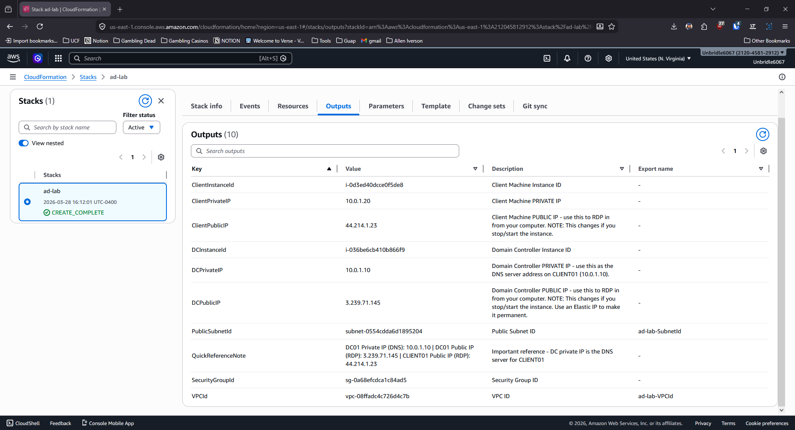
<br />
<br />

Both Windows Server 2022 instances running in EC2 — DC01 at private IP 10.0.1.10 and CLIENT01 at 10.0.1.20.<br/>
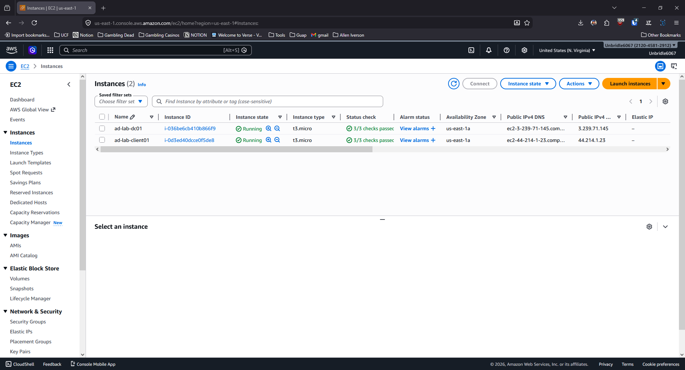
<br />
<br />

RDP'd into DC01 and ran Phase 1 of the automation script. This sets a static IP, installs the AD DS Windows feature, and promotes the server to a domain controller for ramcharam.local. The server reboots automatically on completion.<br/>
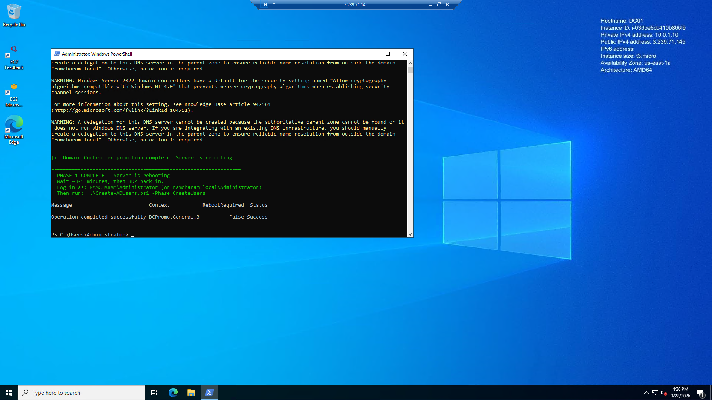
<br />
<br />

After the reboot, Server Manager confirms the AD DS and DNS roles are active on DC01.<br/>
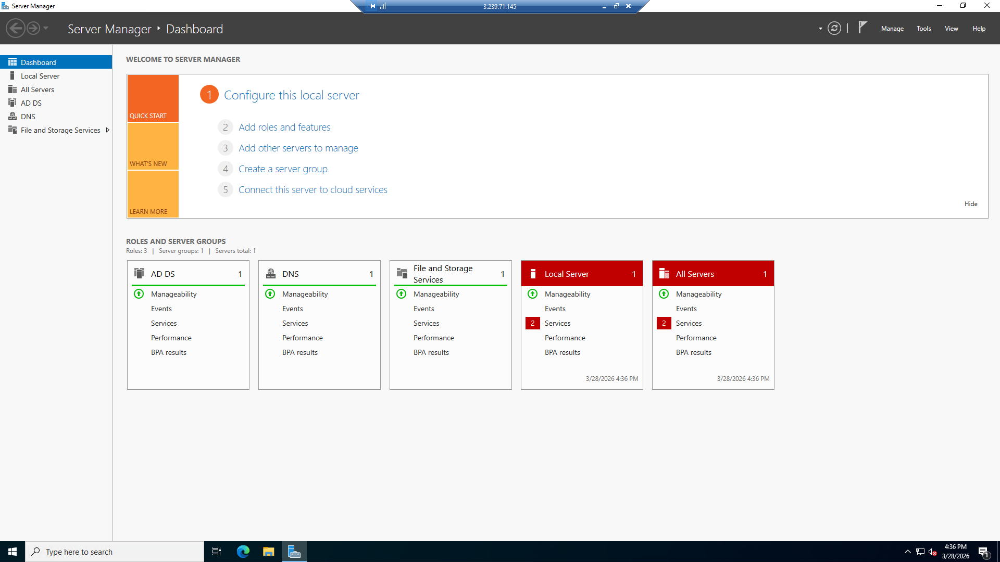
<br />
<br />

Ran Phase 2 of the script — creates four Organizational Units (IT, HR, Finance, Operations) and bulk-provisions 110 domain user accounts with titles, departments, and enabled credentials.<br/>
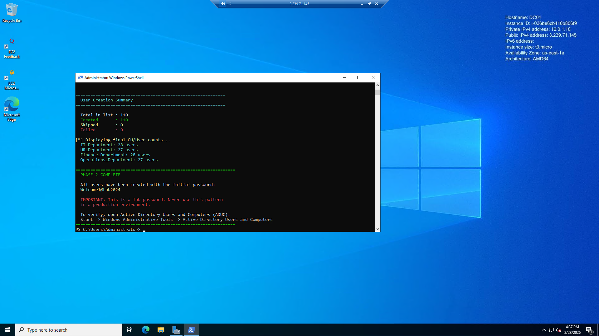
<br />
<br />

Verified the user accounts in Active Directory Users and Computers (ADUC). All four OUs are populated with their respective users.<br/>
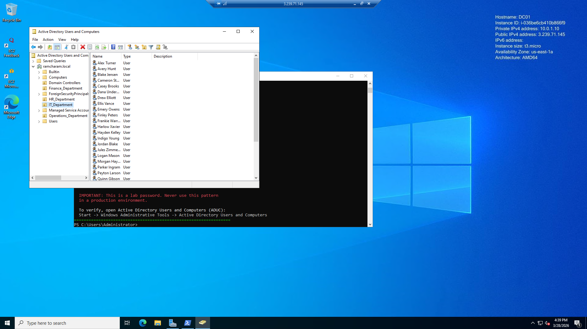
<br />
<br />

DNS Manager on DC01 showing the ramcharam.local forward lookup zone — records for both machines registered correctly.<br/>
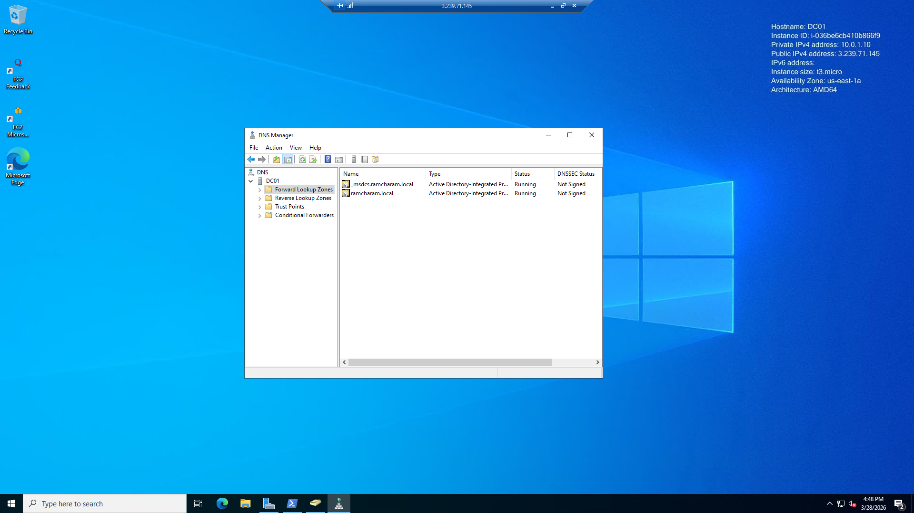
<br />
<br />

On CLIENT01, pointed DNS to DC01's private IP (10.0.1.10) and joined the machine to the ramcharam.local domain.<br/>
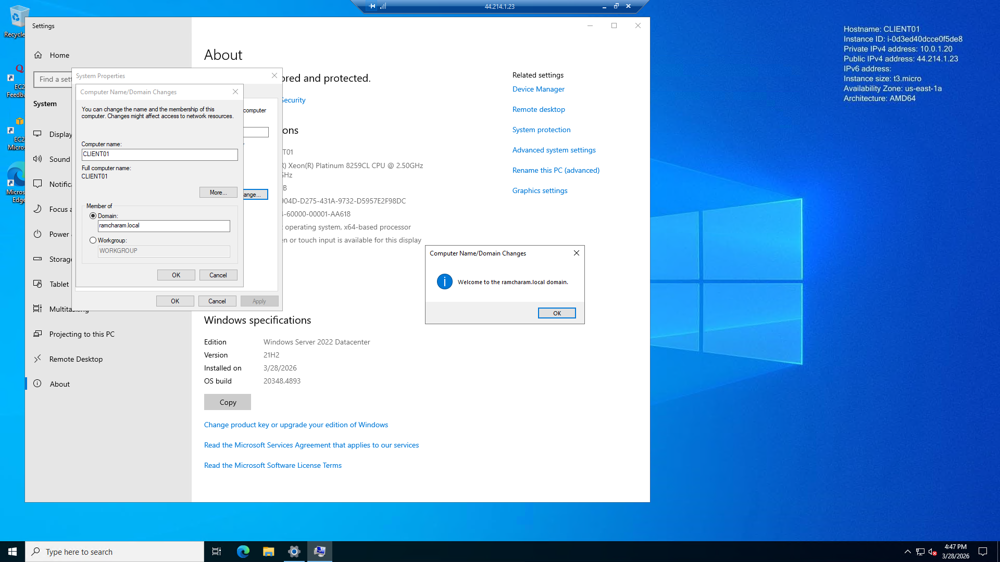
<br />
<br />

RDP'd into CLIENT01 and authenticated as a domain user (RAMCHARAM\alex.turner) — confirming domain login works from the client machine.<br/>
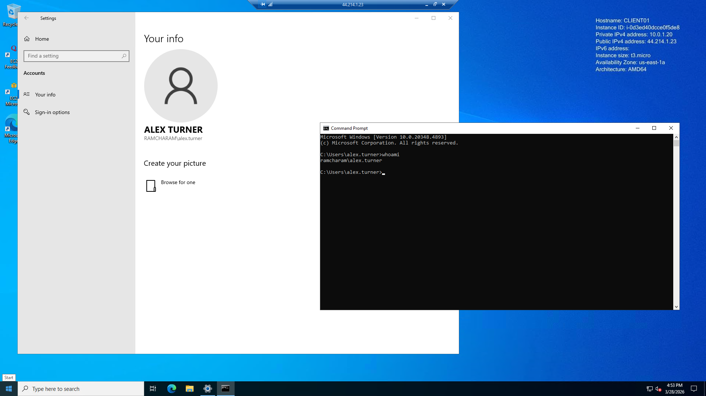
<br />
<br />

Group Policy Management Console (GPMC) open on DC01 — the ramcharam.local domain and default policies are visible and ready for GPO configuration.<br/>
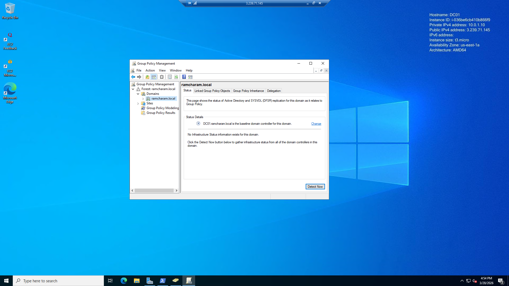
<br />
<br />

PowerShell verification on DC01 — Get-ADComputer confirms CLIENT01 is registered in the domain, and Get-ADUser confirms users are queryable by OU.<br/>
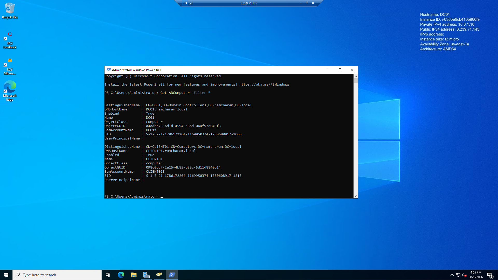
<br />
<br />

</p>

<h2>Results</h2>
Successfully deployed a cloud-hosted Active Directory environment entirely through Infrastructure as Code. The CloudFormation template handles all AWS resource provisioning, while a two-phase PowerShell script automates AD DS installation, domain controller promotion, OU creation, and bulk user provisioning — bringing the domain from zero to 110 active users with no manual clicking. CLIENT01 was domain-joined, DNS-configured, and verified for domain user RDP access. All resources are cleanly removed by deleting the CloudFormation stack, making the lab fully repeatable at minimal cost.
