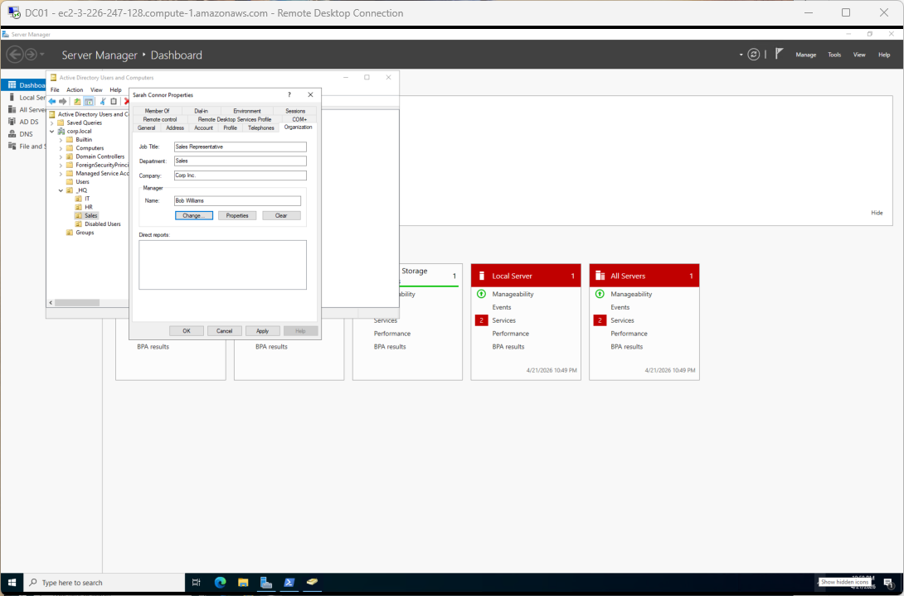
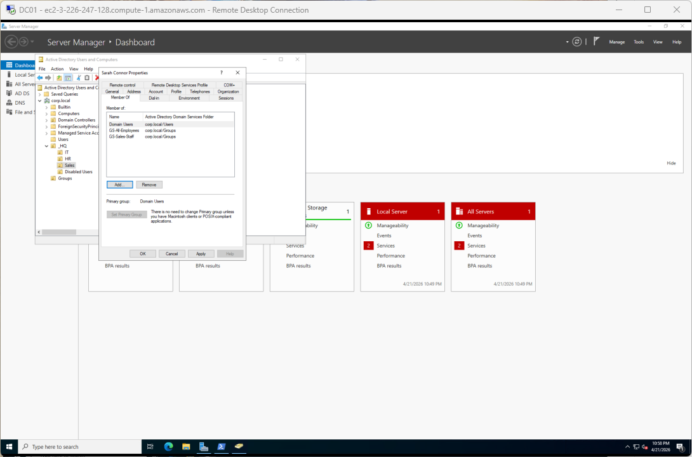
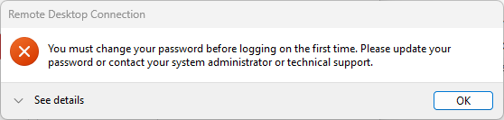
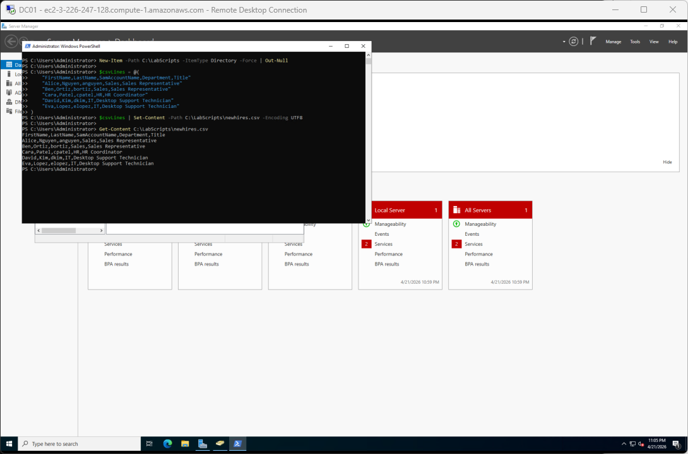
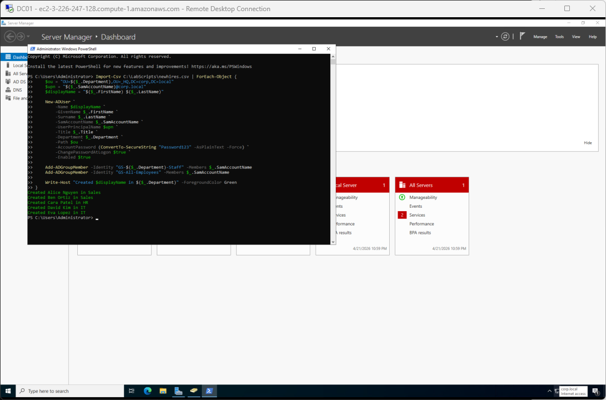
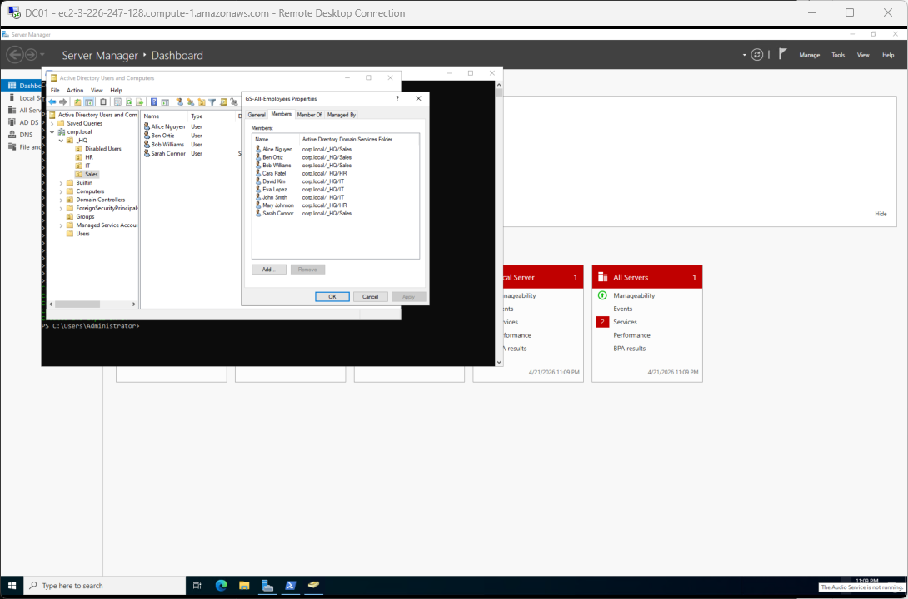

# Scenario S01: New hire onboarding

**[← Back to lab overview](../README.md)**

**Ticket type:** Onboarding request
**Primary admin station:** DC01 (ADUC + PowerShell)
**Verification machine:** CLIENT01

---

## The request

> *"New hire Sarah Connor is starting Monday in the Sales department. Please create her account, give her access to the Sales shared resources, and make sure she has to change her password on first login. Also, five more reps from the recruiting batch are starting next week across Sales, HR, and IT. Can you get them set up too?"*

## What "done" looks like

- A `sconnor` account exists in the Sales OU with profile attributes populated (title, manager, email)
- She's a member of `GS-Sales-Staff` and `GS-All-Employees` so she inherits access to Sales and company-wide resources
- She's forced to pick a new password on first logon
- Five additional accounts from a CSV are provisioned into the correct OUs with the correct group memberships in one PowerShell run
- All new accounts appear in ADUC in the expected locations

## Starting state

Before this ticket, the domain already has three baseline users from lab setup: `jsmith` (IT), `mjohnson` (HR), and `bwilliams` (Sales), plus the OU and group structure shown below. Every new hire needs to land in the right department OU and pick up membership in that department's security group along with `GS-All-Employees`.


---

## Part 1. Onboarding Sarah Connor through ADUC (the Tier 1 way)

### Create the user object

Right-click the Sales OU → New → User. Fill in first name, last name, and a `sconnor` SAM account name. Set an initial password of `Password123` with **User must change password at next logon** ticked, so she is forced to pick her own password the first time she signs on. That matches the ticket's requirement.

### Populate her profile

An AD user object carries far more than a username and password. Filling out the Organization tab (title, department, company, manager) is what makes the account usable by the rest of the business. The HR export, the email Global Address List, and any "who reports to whom" group-based GPO all pull from these fields.



### Grant group memberships

A new hire is nothing without access. On her Member Of tab I added her to both `GS-Sales-Staff` (department-specific access) and `GS-All-Employees` (company-wide resources). Those two memberships mean the next GPO or share permission I wire to either group picks her up automatically.



### Verify on CLIENT01

The last thing a new hire should see is an account that works on their first try. I logged into CLIENT01 as `CORP\sconnor` with the temporary password, and Windows correctly forced the change-on-first-logon flow before letting her onto a desktop.



Sarah's single-user setup is complete.

---

## Part 2. Bulk-provisioning five more hires from CSV

Onboarding rarely happens one user at a time in practice. When HR sends over a batch, I want to run a single command, not open a wizard five times. I wrote the batch into a CSV and let PowerShell loop over it.

### The input file

`C:\LabScripts\newhires.csv` holds five new hires spread across Sales, HR, and IT.



### The provisioning script

The block below reads the CSV, builds a target OU path from each row's Department column, creates the user with the AD cmdlet, and adds them to both the department group and `GS-All-Employees`. Same membership pattern as Sarah's manual setup, just done in a loop.

```powershell
Import-Csv C:\LabScripts\newhires.csv | ForEach-Object {
    $ou = "OU=$($_.Department),OU=_HQ,DC=corp,DC=local"
    $upn = "$($_.SamAccountName)@corp.local"
    $displayName = "$($_.FirstName) $($_.LastName)"

    New-ADUser `
        -Name $displayName `
        -GivenName $_.FirstName `
        -Surname $_.LastName `
        -SamAccountName $_.SamAccountName `
        -UserPrincipalName $upn `
        -Title $_.Title `
        -Department $_.Department `
        -Path $ou `
        -AccountPassword (ConvertTo-SecureString "Password123" -AsPlainText -Force) `
        -ChangePasswordAtLogon $true `
        -Enabled $true

    Add-ADGroupMember -Identity "GS-$($_.Department)-Staff" -Members $_.SamAccountName
    Add-ADGroupMember -Identity "GS-All-Employees" -Members $_.SamAccountName

    Write-Host "Created $displayName in $($_.Department)" -ForegroundColor Green
}
```

Five green "Created ..." lines, no warnings, no red.



### Verify in ADUC

The five new accounts sit in the correct OUs now. Alice and Ben in Sales, Cara in HR, David and Eva in IT. The ADUC right-pane confirms each OU picked up its expected user.



---

## Outcome

| Hire | OU | Department Group | Company Group | Force change on first logon |
|------|-----|------------------|---------------|------------------------------|
| Sarah Connor (`sconnor`) | Sales | `GS-Sales-Staff` | `GS-All-Employees` | Yes |
| Alice Nguyen (`anguyen`) | Sales | `GS-Sales-Staff` | `GS-All-Employees` | Yes |
| Ben Ortiz (`bortiz`) | Sales | `GS-Sales-Staff` | `GS-All-Employees` | Yes |
| Cara Patel (`cpatel`) | HR | `GS-HR-Staff` | `GS-All-Employees` | Yes |
| David Kim (`dkim`) | IT | `GS-IT-Staff` | `GS-All-Employees` | Yes |
| Eva Lopez (`elopez`) | IT | `GS-IT-Staff` | `GS-All-Employees` | Yes |

Six accounts provisioned. First-logon password-change flow verified on CLIENT01. The group memberships mean any future GPO or share ACL wired to these groups picks these users up automatically, with no need to revisit individual accounts.

## What this scenario demonstrates

- Reading an intake ticket and turning it into a concrete set of required AD changes
- Using ADUC for single-item work (fast, visual, good first-90-days habit)
- Moving to PowerShell + CSV for batches (scales to 5 or 500 with the same code)
- Group-based access delegation: `GS-Sales-Staff` and `GS-All-Employees` carry all the permissions, so adding users to the right groups replaces adding permissions to the right users
- Verifying on the user's workstation (CLIENT01), not just the admin console

---

**[← Back to lab overview](../README.md)**
