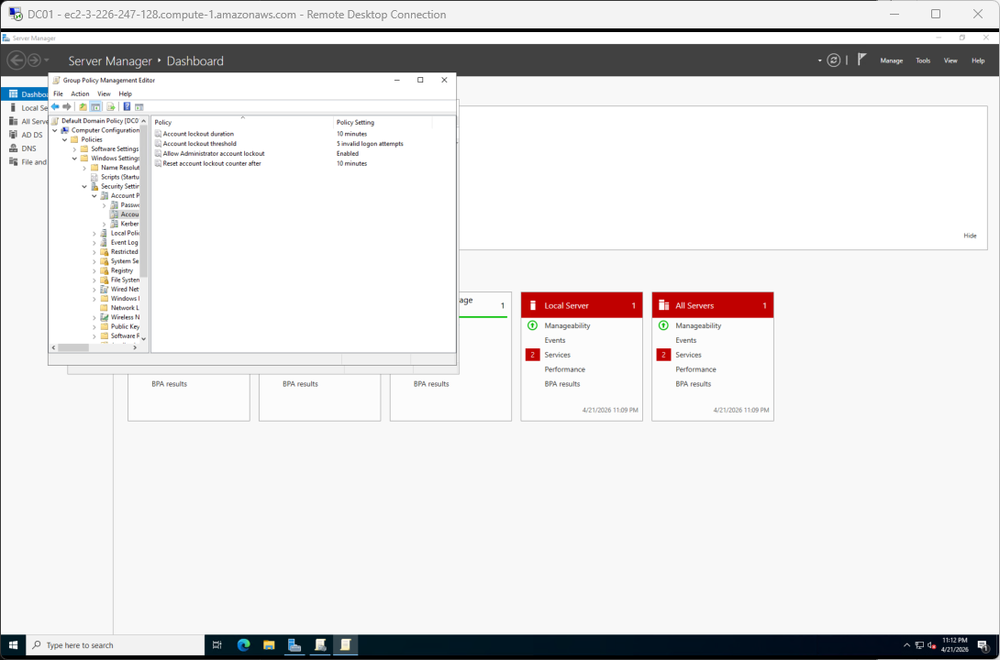
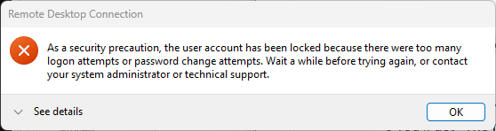
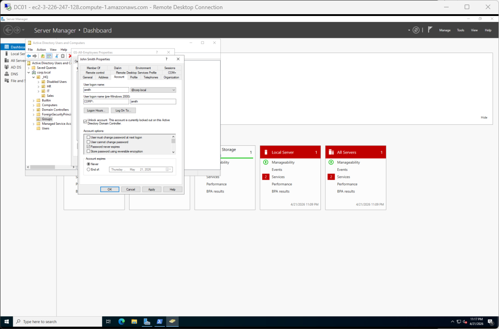
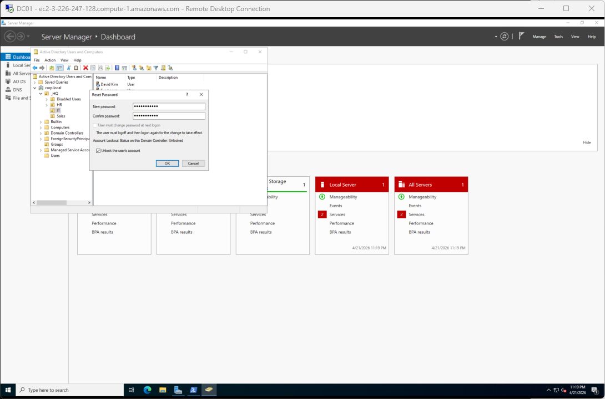
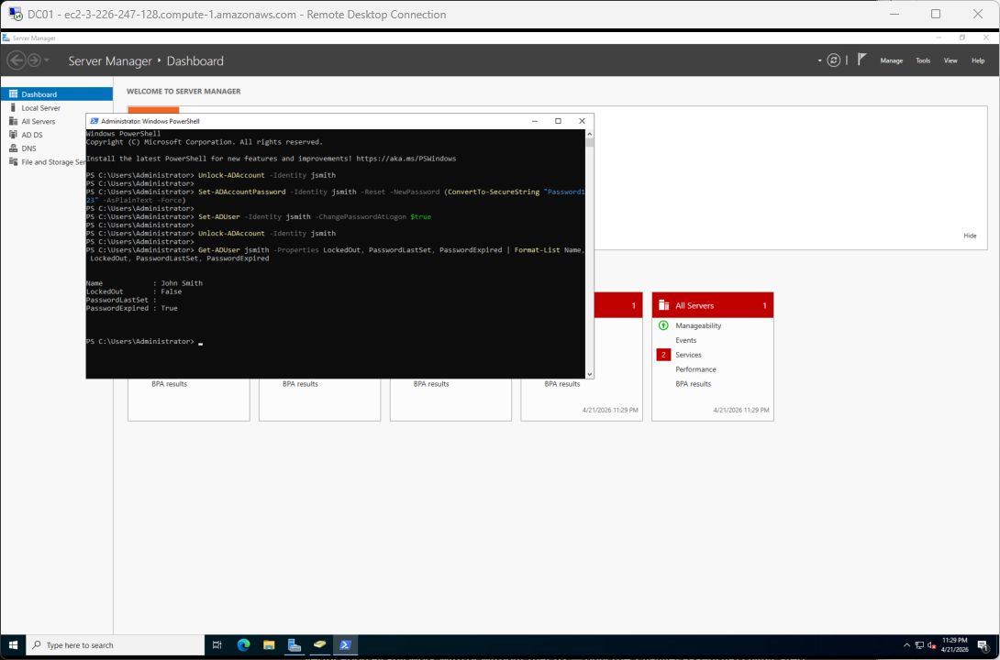
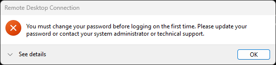
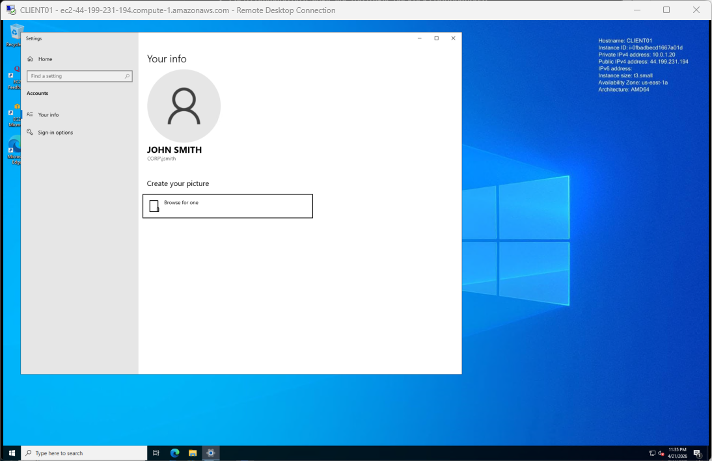

# Scenario S02: Password reset and account unlock

**[← Back to lab overview](../README.md)**

**Ticket type:** Tier 1 password reset / lockout
**Primary admin station:** DC01 (GPMC, ADUC, PowerShell)
**Verification machine:** CLIENT01

---

## The call

> *"User `jsmith` just called. He says he typed his password wrong a bunch of times and now his computer says he's locked out. He also thinks his password needs to be reset because it's been a while. Can you unlock him and reset the password?"*

## What "done" looks like

- `jsmith`'s account is unlocked
- His password is reset to a temporary value with force-change-on-next-logon
- He can sign in with the temporary password (subject to the known RDP + NLA caveat, covered in the closing section)
- The whole reset is captured both through the GUI (ADUC) and through PowerShell, because a Tier 1 who knows both is more useful than one who only knows one

## Starting state

The baseline domain has no lockout policy configured by default. Windows Server 2022 ships Default Domain Policy with the lockout fields blank. To reproduce a realistic lockout in the lab, I had to first set a threshold, refresh policy on both machines, then fail enough logins from CLIENT01 to trip it.

---

## Part 1. Enable the domain lockout policy

Account lockout is one of the rare settings that can only live at the *domain* level in Group Policy. You cannot apply it at an OU. I opened the Default Domain Policy in GPMC on DC01 and walked to **Computer Configuration → Policies → Windows Settings → Security Settings → Account Policies → Account Lockout Policy**. I set the threshold to 5 invalid attempts and accepted the suggested 30-minute duration and reset counter.



> **Safety note I documented for myself.** This policy applies to *every* domain account, including `CORP\Administrator`. Typoing the admin password more than four times on either DC01 or CLIENT01 will lock the domain admin out for 30 minutes, which is a painful way to learn about lockout policies. I ran `gpupdate /force` on both boxes after saving the policy so CLIENT01 would honor the new threshold, not just the DC.

---

## Part 2. Reproduce the lockout from CLIENT01

With the policy pushed, I logged off CLIENT01 and deliberately failed `jsmith`'s password six times in the logon dialog. On the sixth attempt, Windows rejected the attempt with the lockout message, confirming the policy is being enforced end-to-end from DC to client.



This is the symptom a user would report. Every step after this is the help-desk response.

---

## Part 3. Unlock and reset through ADUC (the GUI way)

### Unlock the account

In ADUC on DC01, `jsmith` → Properties → Account tab. The **Unlock account** checkbox appears along with a "currently locked out" notice. Ticking it and hitting OK clears the lockout immediately.



### Reset the password

Right-click `jsmith` → **Reset Password**. The dialog takes the new password, a confirm, and includes a second **Unlock the user's account** checkbox that saves a round trip if the account is still locked.



> **UI behavior caveat.** The "User must change password at next logon" checkbox was grayed out for `jsmith` because I had deliberately set **Password never expires** on his account during lab setup, and the two flags are mutually exclusive. In an environment where users don't have Password Never Expires set, this box is available and is the right setting for a Tier 1 reset.

---

## Part 4. Same workflow through PowerShell (the fast way)

Clicking is fine for one user. Scaling is done with PowerShell. The same reset-and-unlock I just clicked through takes five short commands from DC01:

```powershell
Set-ADUser -Identity jsmith -PasswordNeverExpires $false

Unlock-ADAccount -Identity jsmith

Set-ADAccountPassword -Identity jsmith -Reset -NewPassword (ConvertTo-SecureString "Password123" -AsPlainText -Force)

Set-ADUser -Identity jsmith -ChangePasswordAtLogon $true

Get-ADUser jsmith -Properties LockedOut, PasswordLastSet, PasswordExpired | Format-List Name, LockedOut, PasswordLastSet, PasswordExpired
```

The first line clears the Password-Never-Expires flag so the force-change-at-next-logon setting will accept (same constraint as the grayed-out GUI checkbox). The next three do the reset. The last line is the verification. I want to see `LockedOut: False` and a fresh `PasswordLastSet` before I close the ticket.



---

## Part 5. The RDP + NLA + forced-change wall (a Windows limitation)

Tried to log in from CLIENT01 as `CORP\jsmith` with the new temporary password, and ran straight into this:



The RDP client is refusing to proceed. This is not a bug. It is a documented Windows limitation:

- **Network Level Authentication (NLA)** validates credentials *before* the RDP session starts.
- **Forced password change** can only happen *inside* an interactive session (the user needs a Windows shell to type the new password into).
- Those two requirements contradict each other. NLA will not build a session without valid credentials, but the credentials are only invalid because of the change flag, which can only be cleared by building a session.

A help-desk tech needs to know two things at this point: (1) this is why the user is calling back saying "I still can't log in," and (2) the resolutions.

**Resolutions in production:**

- Have the user sign in at a physical console (or any interface without NLA) to do the change, then RDP works.
- The admin does the change on the user's behalf with the old + new password form of `Set-ADAccountPassword`, which clears the force-change flag. Communicate the new password out of band (phone, not email).
- Disable NLA on specific non-production machines. Discouraged for security reasons but documented for completeness.

### The admin-side workaround I used

From DC01, I ran the old-and-new form of the reset to simulate `jsmith` changing his own password from `Password123` to `Password123!`:

```powershell
Set-ADAccountPassword -Identity jsmith `
    -OldPassword (ConvertTo-SecureString "Password123" -AsPlainText -Force) `
    -NewPassword (ConvertTo-SecureString "Password123!" -AsPlainText -Force)
```

This updates `pwdLastSet` to the current time, which clears the force-change flag. RDP'd back in as `CORP\jsmith` / `Password123!` and landed on his desktop cleanly.



---

## Outcome

- Lockout policy configured at the domain level and verified on both DC01 and CLIENT01
- `jsmith`'s account unlocked through ADUC, then again through PowerShell for documentation
- Password reset through both paths
- RDP + NLA + forced-change limitation demonstrated with captured error, explained in plain language, and worked around with the old-and-new password form

## What this scenario demonstrates

- Domain-level Group Policy scope for password and lockout policies
- ADUC reset-and-unlock workflow (what a Tier 1 tech clicks on day one)
- AD module PowerShell equivalents (what scales to batch operations and what you demo in interviews)
- Recognition of an RDP behavior that is not documented in the ticket, plus knowledge of the explanation and the workaround
- Verification discipline: `Get-ADUser` with `LockedOut`, `PasswordLastSet`, and `PasswordExpired` before closing

---

**[← Back to lab overview](../README.md)**
