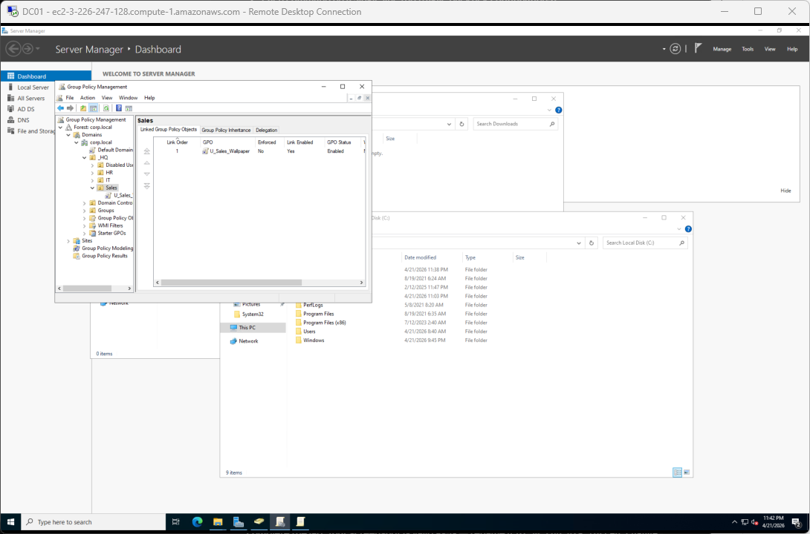
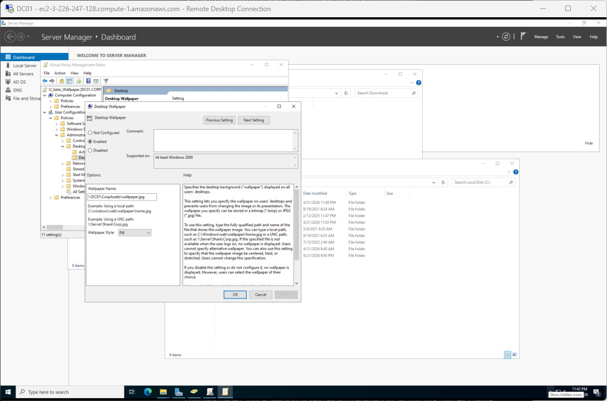
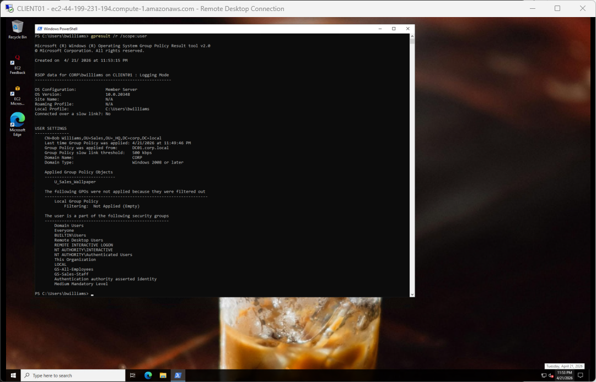
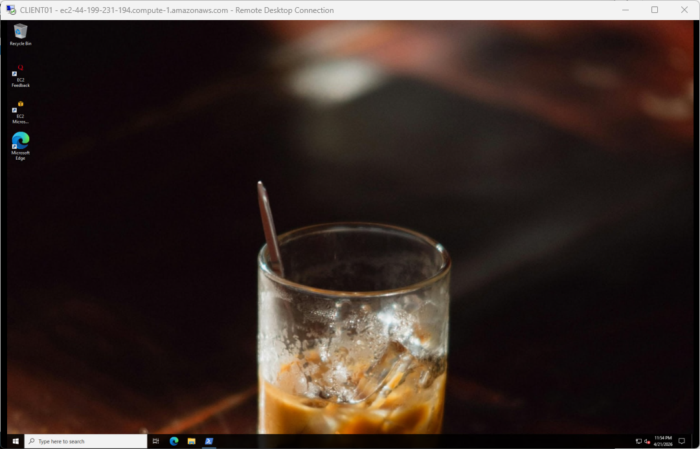
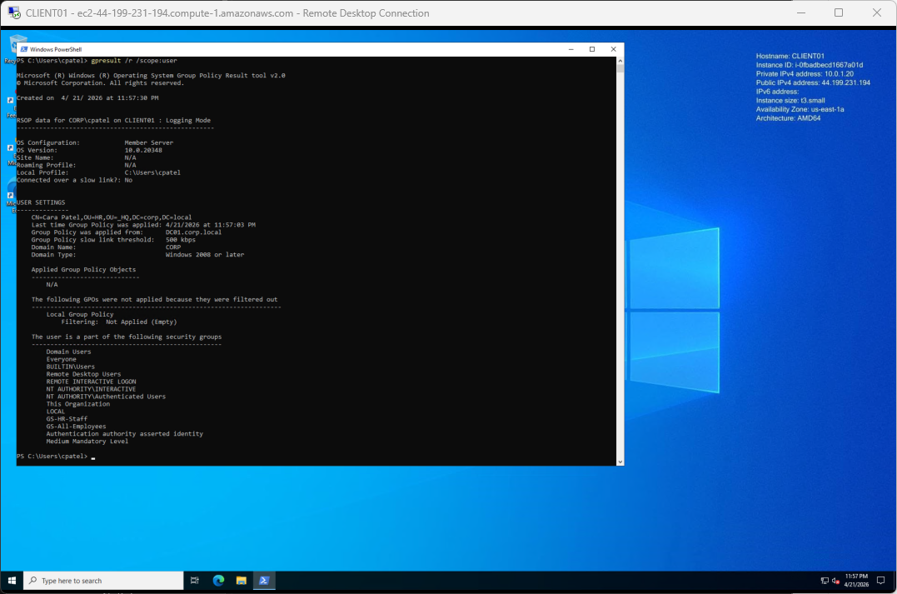
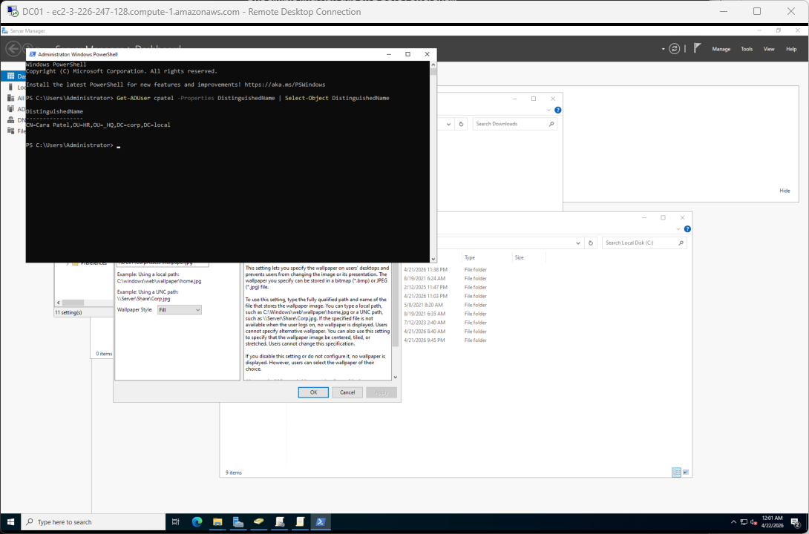
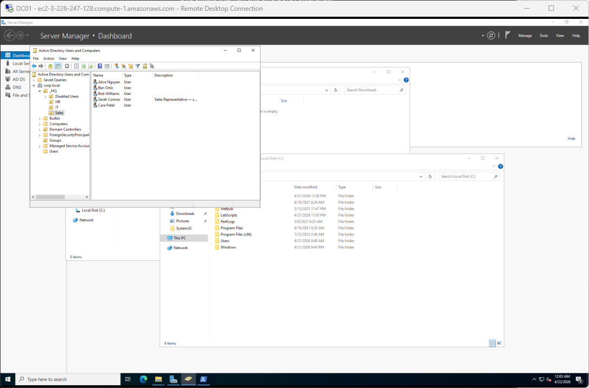
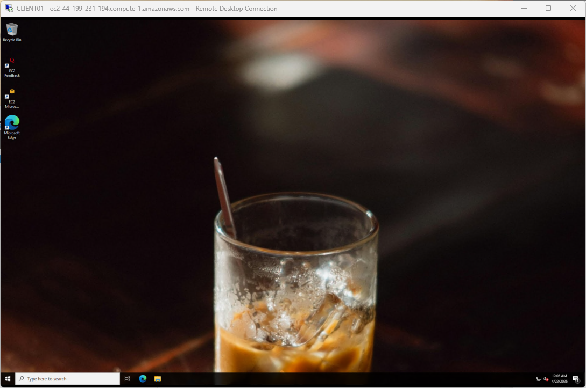
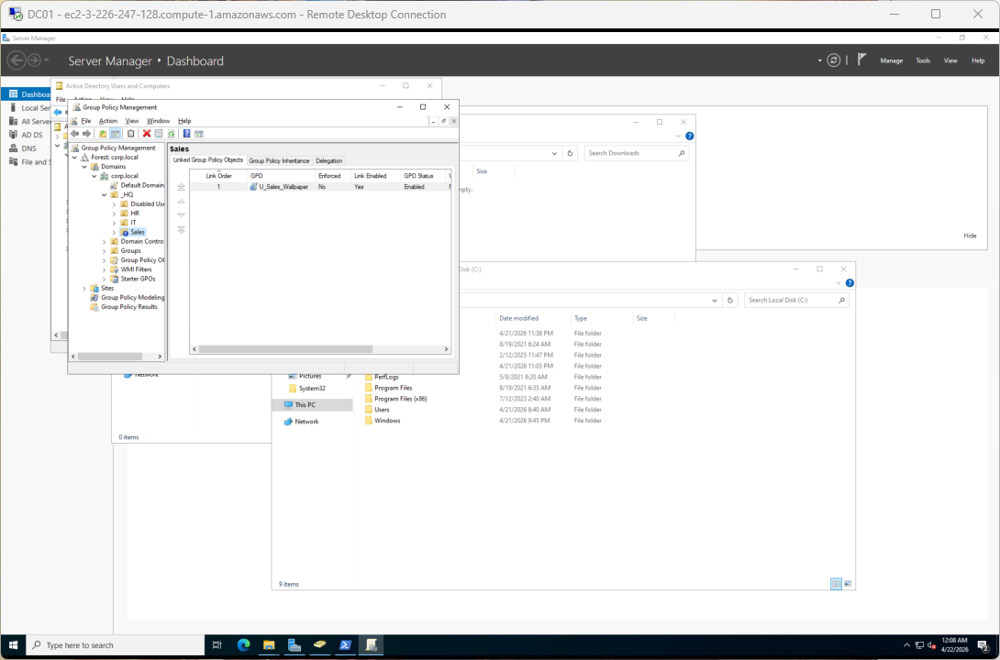
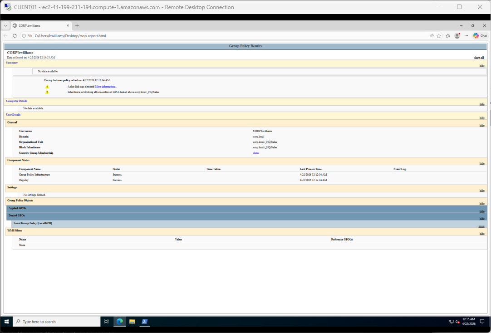

# Scenario S03: Group Policy troubleshooting

**[← Back to lab overview](../README.md)**

**Ticket type:** Tier 1/2 GPO application issue
**Primary admin station:** DC01 (File Explorer, GPMC, ADUC, PowerShell)
**Verification machine:** CLIENT01

---

## The ticket

> *"IT asked for a corporate desktop wallpaper deployed to all Sales users. Marketing uploaded the image. Please get it deployed. Also, Cara Patel on the Sales team is not getting the wallpaper even though it's showing up for everyone else — please figure out why and fix it."*

## What "done" looks like

- A user-scope GPO named `U_Sales_Wallpaper` exists, targeting the Sales OU, pointing at the shared wallpaper file
- Sales users see the wallpaper on their desktop after a normal logon
- `cpatel` specifically is diagnosed, the root cause explained in one sentence, and the fix applied and verified
- A bonus Block Inheritance demonstration shows a second way GPO deployments break, so I recognize the symptom next time

---

## Part 1. Deploying the wallpaper GPO

### Stage the wallpaper file on the DC

Created `C:\CorpAssets\` on DC01, dropped a `wallpaper.jpg` in it, shared the folder with **Read** access for `Authenticated Users`. The UNC path clients will reference is `\\DC01\CorpAssets\wallpaper.jpg`. Authenticated Users covers both user and computer accounts, which matters because GPO retrieval runs under both contexts.

### Create and link the GPO

In GPMC on DC01 I right-clicked the Sales OU → **Create a GPO in this domain, and Link it here** → named it `U_Sales_Wallpaper`. The `U_` prefix is a naming convention that tells me at a glance this is a User-scope policy. Sales-targeted policies belong linked directly to the Sales OU.



### Configure the wallpaper setting

Inside the GPO: **User Configuration → Policies → Administrative Templates → Desktop → Desktop → Desktop Wallpaper**. Enabled, with the UNC path `\\DC01\CorpAssets\wallpaper.jpg` and Wallpaper Style `Fill`.



---

## Part 2. Verify the wallpaper on a Sales user

Logged into CLIENT01 as `CORP\bwilliams` / `Password123`. Bob Williams is one of the baseline Sales users, with no force-change flag, so RDP works cleanly.

The wallpaper is already on his desktop the moment he logs in. **Why no `gpupdate /force`?** User-scope GPOs apply automatically as part of the logon process. Windows reads and applies them while building the session. `gpupdate` is only needed to refresh policies *mid-session*. A fresh logon always pulls the latest user-scope state.

`gpresult /r /scope:user` confirms the GPO is listed under Applied:





Part one of the ticket closed. Deployment is working for the target audience.

---

## Part 3. Why `cpatel` didn't get it

### Prereq: clear her force-change flag so RDP will let me in

`cpatel` was provisioned in the bulk-CSV onboarding (see [Scenario S01](S01-new-hire-onboarding.md)), which means she has `ChangePasswordAtLogon = true` and would hit the same [RDP + NLA wall](S02-password-reset-and-unlock.md#part-5-the-rdp--nla--forced-change-wall-a-windows-limitation) documented in Scenario S02. For this troubleshoot I don't need to demonstrate a password change. I just need her to log in. So I cleared the flag on DC01:

```powershell
Set-ADUser -Identity cpatel -ChangePasswordAtLogon $false
```

Her password stays `Password123`. RDP now lets her in.

### Step 1. Confirm the symptom (on CLIENT01)

Logged off `bwilliams`, logged in as `CORP\cpatel` / `Password123`. Desktop: plain default, no corporate wallpaper. `gpresult /r /scope:user` for her session shows `U_Sales_Wallpaper` is **not** under Applied. It's either missing from the listing entirely or appearing under the "filtered out / not applied" block.



### Step 2. Find the root cause (on DC01)

User-scope GPOs apply based on **the OU the user object lives in**, not the OU of the computer they're logged into. So the question is: where does `cpatel` live in AD?

```powershell
Get-ADUser cpatel -Properties DistinguishedName | Select-Object DistinguishedName
```

> **Run this on DC01, not CLIENT01.** `Get-ADUser` comes from the Active Directory PowerShell module, which ships on Domain Controllers by default but is not on domain-joined clients. Running it on CLIENT01 gives *"The term 'Get-ADUser' is not recognized"*. This also matches help-desk hygiene: check AD object state from the admin station, not the user's workstation.



The DN reveals the bug: `OU=HR,OU=_HQ,DC=corp,DC=local`. She is in the **HR** OU, not Sales. The `U_Sales_Wallpaper` GPO is linked to the Sales OU, so it has no reason to target her user object.

In plain-English ticket language: *Cara's AD account was created under HR during onboarding and never got moved to Sales when she transferred, so the Sales-linked wallpaper policy doesn't target her.*

### Step 3. Fix it (on DC01)

Moved her user object into the Sales OU. Two ways. I used the GUI in ADUC for the screenshot, but the PowerShell one-liner is equally valid.

**GUI:** ADUC → HR → right-click `cpatel` → Move → select `_HQ > Sales` → OK.
**PowerShell:** `Get-ADUser cpatel | Move-ADObject -TargetPath "OU=Sales,OU=_HQ,DC=corp,DC=local"`



### Step 4. Verify (on CLIENT01)

On CLIENT01, logged out of cpatel's session, logged back in as `CORP\cpatel` / `Password123`. The wallpaper is on her desktop immediately. No `gpupdate /force`, no second logon, no dance. User-scope GPOs re-resolve at logon based on the user's *current* OU, and her current OU is now Sales.



Part two of the ticket closed. Root cause explained, fix applied, verified.

---

## Part 4. Bonus: the Block Inheritance trap

A second way the same kind of ticket gets opened: *"We had the wallpaper working last week, and now some users aren't getting it."* The usual culprit when a previously-working GPO silently stops applying is **Block Inheritance** on the OU, especially when someone moved the GPO link from the child OU up to the parent.

I reproduced this in the lab to document the symptom.

### Step 1. Turn on Block Inheritance on Sales (GPMC on DC01)

Right-click the Sales OU → Block Inheritance. A small blue `!` badge appears on the Sales OU in GPMC. That's the visual indicator that inheritance is blocked.



### Step 2. Observe (on CLIENT01) that the wallpaper still works

Logged in as `bwilliams`. Wallpaper still applies. **Why?** The GPO is linked *directly* to Sales. Block Inheritance only blocks GPOs coming *from parent OUs*. A GPO linked right on the OU with Block Inheritance enabled still runs.

### Step 3. Re-home the GPO link to `_HQ` (the mistake, on DC01)

This is the step a junior admin might take thinking "I'll put it at the parent OU so every department gets it later":

1. Right-click `U_Sales_Wallpaper` under Sales → **Delete** → **Remove the link** (this removes the *link* only; the GPO itself still exists under Group Policy Objects in the left pane).
2. Right-click `_HQ` → **Link an Existing GPO** → select `U_Sales_Wallpaper` → OK.

### Step 4. Observe (on CLIENT01) that the wallpaper is now broken

Logged off and back in as `bwilliams`. No wallpaper. This is the ticket symptom. The `_HQ`-linked GPO is trying to flow down to Sales users, and Block Inheritance on the Sales OU is stopping it cold.

I generated a full HTML GPO report on CLIENT01 to confirm the denied state:

```powershell
gpresult /h "$env:USERPROFILE\Desktop\rsop-report.html" /f
Start-Process "$env:USERPROFILE\Desktop\rsop-report.html"
```

The report's **User Details** section lists `U_Sales_Wallpaper` under Denied GPOs with the reason.



> **Why `gpresult /h` and not `rsop.msc`?** `rsop.msc` is legacy and only reports Security Settings and Software Restriction policies. It does not show Administrative Templates, which is exactly where wallpaper and most other user-facing settings live. `gpresult /h` writes a complete HTML Group Policy report and is the current standard.

### Step 5. Fix and verify (GPMC on DC01, then CLIENT01)

Unticked Block Inheritance on the Sales OU. The blue `!` badge disappears. Logged back in as `bwilliams` on CLIENT01 and the wallpaper returns.

### Step 6. Clean up so the lab is in a known-good state

Moved the `U_Sales_Wallpaper` link back to Sales OU (where it started). Final state: GPO linked at Sales, no Block Inheritance, wallpaper working for all Sales users including the newly-moved `cpatel`.

---

## Outcome

- Corporate wallpaper GPO deployed to all Sales users
- `cpatel`'s case diagnosed end-to-end: wrong OU → Sales GPO didn't target her → moved to Sales → wallpaper applies on next logon
- Block Inheritance trap demonstrated and documented so the next ticket of this shape is recognizable on sight
- Modern GPO diagnostic workflow (`gpresult /r` + `gpresult /h`) used, with the reason `rsop.msc` is obsolete for this kind of check

## What this scenario demonstrates

- GPO creation, linking, and scope (OU-targeting, user vs. computer configuration)
- The three-part diagnostic that covers the majority of "GPO not applying" tickets: what does `gpresult` say is applied, where does the user actually live in AD, does Block Inheritance break the inheritance chain
- Using PowerShell + AD module from the DC to inspect and move user objects rather than clicking through ADUC when the answer is a single DN
- Choosing the current tool (`gpresult /h` HTML) over the legacy one (`rsop.msc`) and knowing why
- Cleaning up after yourself. The last screenshot of any troubleshooting scenario should be a known-good state, not the broken one used to generate evidence

---

**[← Back to lab overview](../README.md)**
